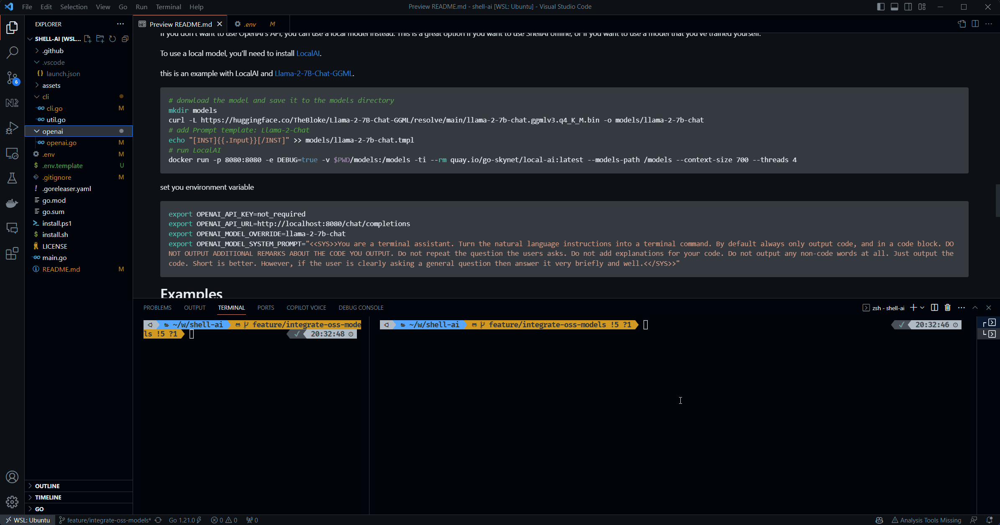

# ShellAI
A delightfully minimal, yet remarkably powerful AI Shell Assistant.


>
> "Ten minutes of Googling is now ten seconds in the terminal."
>
>   ~ Joe C.
>

# About

For developers, referencing things online is inevitable – but one can only look up "how to do [X] in git" so many times before losing your mind.

**ShellAI** is meant to be a faster and smarter alternative to online reference: for shell commands, code examples, error outputs, and high-level explanations. We believe tools should be beautiful, minimal, and convenient, to let you get back to what you were doing as quickly and pleasantly as possible. That is the purpose of ShellAI.

# Install

### Homebrew

```bash
brew tap ibigio/tap
brew install shell-ai
```

### Linux

```bash
curl https://raw.githubusercontent.com/ibigio/shell-ai/main/install.sh | bash
```

# Usage

Type `q` followed by a description of a shell command, code snippet, or general question!

### Features
- Generate shell commands from a description.
- Reference code snippets for any programming language.
- Fast, syntax-highlighted, minimal UI.
- Auto-extract code from response and copy to clipboard.
- Follow up to refine command or explanation.
- Concise, helpful responses.
- Tailored support for GPT 3.5 and GPT 4.

### Settings

Set your [OpenAI API key](https://platform.openai.com/account/api-keys).
```bash
export OPENAI_API_KEY=[your key]
```

Select between GPT 3.5 (default, faster) and GPT 4 (smarter).

```bash
export OPENAI_MODEL_OVERRIDE="gpt-4"
```
### Using open source LLM models with LocalAI

If you don't want to use OpenAI's API, you can use a local model instead. This is a great option if you want to use ShellAI offline, or if you want to use a model that you've trained yourself.

To use a local model, you'll need to install [LocalAI](https://localai.io/).


this is an example with LocalAI and [Llama-2-7B-Chat-GGML](https://huggingface.co/TheBloke/Llama-2-7B-Chat-GGML).
```bash
# donwload the model and save it to the models directory
mkdir models
curl -L https://huggingface.co/TheBloke/Llama-2-7B-Chat-GGML/resolve/main/llama-2-7b-chat.ggmlv3.q4_K_M.bin -o models/llama-2-7b-chat
# add Prompt template: Llama-2-Chat
echo "[INST]{{.Input}}[/INST]" >> models/llama-2-7b-chat.tmpl
# run LocalAI
docker run -p 8080:8080 -e DEBUG=true -v $PWD/models:/models -ti --rm quay.io/go-skynet/local-ai:latest --models-path /models --context-size 700 --threads 4 
```
set you environment variable
```bash
export OPENAI_API_KEY=not_required
export OPENAI_API_URL=http://localhost:8080/chat/completions
export OPENAI_MODEL_OVERRIDE=llama-2-7b-chat
export OPENAI_MODEL_SYSTEM_PROMPT="<<SYS>>You are a terminal assistant. Turn the natural language instructions into a terminal command. By default always only output code, and in a code block. DO NOT OUTPUT ADDITIONAL REMARKS ABOUT THE CODE YOU OUTPUT. Do not repeat the question the users asks. Do not add explanations for your code. Do not output any non-code words at all. Just output the code. Short is better. However, if the user is clearly asking a general question then answer it very briefly and well.<</SYS>>"
```
Demo :


# Examples
### Shell Commands
`$ q make a new git branch`
```
git branch new-branch
```
`$ q find files that contain "administrative" in the name`
```
find /path/to/directory -type f -name "*administrative*"
```
### Code Snippets
`$ q initialize a static map in golang`
```golang
var staticMap = map[string]int{
    "key1": 1,
    "key2": 2,
    "key3": 3,
}
```
`$ q create a generator function in python for dates`
```python
def date_generator(start_date, end_date):
    current_date = start_date
    while current_date <= end_date:
        yield current_date
        current_date += datetime.timedelta(days=1)
```

# Contributing

ShellAI is polished but by no means finished, feel free to open issues or pull requests on the repo! If you have other ideas or just want to say hi, go ahead and reach out!
